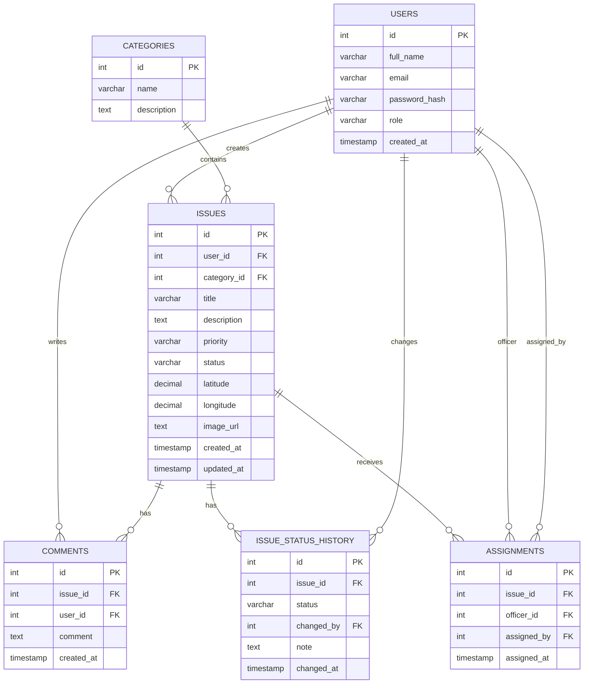

# CivicPulse LK — Database Design

## Entity Relationship Diagram

## Main Relationships

- One user can create many issues.
- One category can contain many issues.
- One issue can have many comments.
- One issue can have many status-history records.
- One issue can have assignment records.
- Users can act as citizens, field officers, or administrators.

## Why Separate Tables?

CivicPulse uses separate tables to avoid duplicated data and keep the database easier to maintain.

For example, citizen information is stored once in `users`. Issues reference that user using `user_id` instead of copying the citizen's name and email into every issue.

This is part of database normalization.